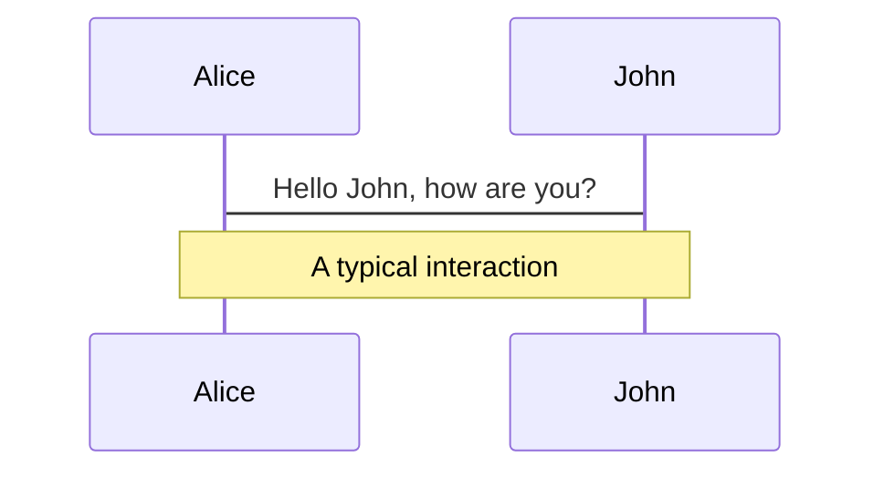
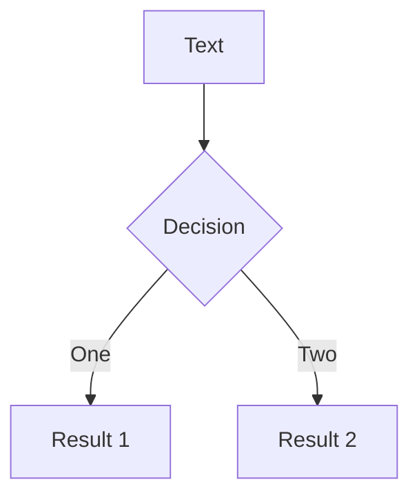

# Web Vitals

谷歌的新一代 Web 性能体验和质量指标

<a href="https://github.com/lanxuexing/web-vitails" target="_blank" alt="GitHub"
  class="abs-br m-6 text-xl icon-btn opacity-50 !border-none !hover:text-white">
  <carbon-logo-github />
</a>


---


# 什么是Web Vitails

> Web Vitals是Google的一项重大举措，旨在为质量信号提供统一的指导，这对于在Web上提供出色的用户体验来说很重要。
<br/>
> 网站的开发者需要了解自己的网站给用户带来的体验，但不一定要成为性能优化的专家。Web Vitals旨在简化流程，并帮助网站开发者聚焦在核心性能指标上，也称为Core Web Vitals。


---


# Core Web Vitals

<div class="pt-12 flex justify-center">
  <div>
    
    <p class="text-center opacity-50 cursor-pointer text-sm">
      <a href="https://web.dev/lcp/" target="_blank" rel="noopener">最大内容绘制</a>
    </p>
  </div>
  <div>
    
    <p class="text-center opacity-50 cursor-pointer text-sm">
      <a href="https://web.dev/fid/" target="_blank" rel="noopener">首次输入延迟</a>
    </p>
  </div>
  <div>
    
    <p class="text-center opacity-50 cursor-pointer text-sm">
      <a herf="https://web.dev/cls/" target="_blank" rel="noopener">累积布局偏移</a>
    </p>
  </div>
</div>

<!-- 
LCP：加载体验
FID：交互性
CLS：页面内容的视觉稳定性
 -->


---
layout: center
class: text-center
---

# LCP (Largest Contentful Paint)

加载体验 **·** 最大内容绘制


---

# 如何准确衡量网站的性能 <Marker class="text-purple-400">Thinking</Marker>

以用户为中心的性能指标，应该能回答以下四个问题

<br>

- **是否发生？** 导航是否成功启动？服务器是否有响应？
- **是否有用？** 是否已渲染可以与用户互动的足够内容？
- **是否有用？** 用户可以与页面交互，还是页面仍在忙于加载？
- **是否令人愉快？** 交互是否顺畅而自然，没有滞后和卡顿？

<style>
  strong {
    color: #22c55e;
  }
</style>

---

# 性能指标（Performance Metrics）

<div class="grid grid-cols-2 gap-x-4">

- **Load** - 当整个页面加载完成时（包括所有依赖资源，如样式表和图像）触发该事件

```ts
window.addEventListener('load', (event) => {
  console.log('page is fully loaded');
});
```

- **DOMContentLoaded** - HTML加载完成时（无需等待样式、图片和子框架加载完成）触发该事件

```ts
window.addEventListener('DOMContentLoaded', (event) => {
    console.log('DOM fully loaded and parsed');
});
```

</div>


<style>
  strong {
    color: #22c55e;
  }
  img {
    margin-top: -90px;
    filter: invert(100%);
    clip-path: inset(100px 50px 140px 60px);
  }
</style>

---

# LCP (Largest Contentful Paint) <MarkerCore />

最大内容绘制时间，计算从页面开始加载到用户与页面发生交互（点击，滚动）这段时间内，最大元素绘制的时间，该时间会随着页面渲染变化而变化，因为页面中的最大元素在渲染过程中可能会发生改变。

<div class="grid grid-cols-2 gap-x-4 pt-10">

- **Load** - 当整个页面加载完成时（包括所有依赖资源，如样式表和图像）触发该事件。

```ts
window.addEventListener('load', (event) => {
  console.log('page is fully loaded');
});
```

- **DOMContentLoaded** - HTML加载完成时（无需等待样式、图片和子框架加载完成）触发该事件。

```ts
window.addEventListener('DOMContentLoaded', (event) => {
    console.log('DOM fully loaded and parsed');
});
```

</div>

<style>
/* h1 {
  background-color: #2B90B6;
  background-image: linear-gradient(45deg, #4EC5D4 10%, #146b8c 20%);
  background-size: 100%;
  -webkit-background-clip: text;
  -moz-background-clip: text;
  -webkit-text-fill-color: transparent; 
  -moz-text-fill-color: transparent;
} */
</style>

---

# Navigation

Hover on the bottom-left corner to see the navigation's controls panel, [learn more](https://sli.dev/guide/navigation.html)

### Keyboard Shortcuts

|     |     |
| --- | --- |
| <kbd>right</kbd> / <kbd>space</kbd>| next animation or slide |
| <kbd>left</kbd> | previous animation or slide |
| <kbd>up</kbd> | previous slide |
| <kbd>down</kbd> | next slide |

<!-- https://sli.dev/guide/animations.html#click-animations -->

<p v-after class="absolute bottom-23 left-45 opacity-30 transform -rotate-10">Here!</p>

---
layout: image-right
image: https://source.unsplash.com/collection/94734566/1920x1080
---

# Code

Use code snippets and get the highlighting directly!

<!-- https://sli.dev/guide/syntax.html#line-highlighting -->

```ts {all|2|1-6|9|all}
interface User {
  id: number
  firstName: string
  lastName: string
  role: string
}

function updateUser(id: number, update: User) {
  const user = getUser(id)
  const newUser = {...user, ...update}  
  saveUser(id, newUser)
}
```

<arrow v-click="3" x1="400" y1="420" x2="230" y2="330" color="#564" width="3" arrowSize="1" />

---

# Components

<div grid="~ cols-2 gap-4">
<div>

You can use Vue components directly inside your slides.

We have provided a few built-in components like `<Tweet/>` and `<Youtube/>` that you can use directly. And adding your custom components is also super easy.

```html
<Counter :count="10" />
```

<!-- ./components/Counter.vue -->
<Counter :count="10" m="t-4" />

Check out [the guides](https://sli.dev/builtin/components.html) for more.

</div>
<div>

```html
<Tweet id="1390115482657726468" />
```

<Tweet id="1390115482657726468" scale="0.65" />

</div>
</div>


---
class: px-20
---

# Themes

Slidev comes with powerful theming support. Themes can provide styles, layouts, components, or even configurations for tools. Switching between themes by just **one edit** in your frontmatter:

<div grid="~ cols-2 gap-2" m="-t-2">

```yaml
---
theme: default
---
```

```yaml
---
theme: seriph
---
```


</div>

Read more about [How to use a theme](https://sli.dev/themes/use.html) and
check out the [Awesome Themes Gallery](https://sli.dev/themes/gallery.html).

---
preload: false
---

# Animations

Animations are powered by [@vueuse/motion](https://motion.vueuse.org/).

```html
<div
  v-motion
  :initial="{ x: -80 }"
  :enter="{ x: 0 }">
  Slidev
</div>
```

<div class="w-60 relative mt-6">
  <div class="relative w-40 h-40">
    
    
    
  </div>

  <div 
    class="text-5xl absolute top-14 left-40 text-[#2B90B6] -z-1"
    v-motion
    :initial="{ x: -80, opacity: 0}"
    :enter="{ x: 0, opacity: 1, transition: { delay: 2000, duration: 1000 } }">
    Slidev
  </div>
</div>

<!-- vue script setup scripts can be directly used in markdown, and will only affects current page -->
<script setup lang="ts">
const final = {
  x: 0,
  y: 0,
  rotate: 0,
  scale: 1,
  transition: {
    type: 'spring',
    damping: 10,
    stiffness: 20,
    mass: 2
  }
}
</script>

<div
  v-motion
  :initial="{ x:35, y: 40, opacity: 0}"
  :enter="{ y: 0, opacity: 1, transition: { delay: 3500 } }">

[Learn More](https://sli.dev/guide/animations.html#motion)

</div>

---

# LaTeX

LaTeX is supported out-of-box powered by [KaTeX](https://katex.org/).

<br>

Inline $\sqrt{3x-1}+(1+x)^2$

Block
$$
\begin{array}{c}

\nabla \times \vec{\mathbf{B}} -\, \frac1c\, \frac{\partial\vec{\mathbf{E}}}{\partial t} &
= \frac{4\pi}{c}\vec{\mathbf{j}}    \nabla \cdot \vec{\mathbf{E}} & = 4 \pi \rho \\

\nabla \times \vec{\mathbf{E}}\, +\, \frac1c\, \frac{\partial\vec{\mathbf{B}}}{\partial t} & = \vec{\mathbf{0}} \\

\nabla \cdot \vec{\mathbf{B}} & = 0

\end{array}
$$

<br>

[Learn more](https://sli.dev/guide/syntax#latex)

---

# Diagrams

You can create diagrams / graphs from textual descriptions, directly in your Markdown.

<div class="grid grid-cols-2 gap-4 pt-4 -mb-6">





</div>

[Learn More](https://sli.dev/guide/syntax.html#diagrams)


---
layout: center
class: text-center
---

# Learn More

[Documentations](https://sli.dev) / [GitHub Repo](https://github.com/slidevjs/slidev)
